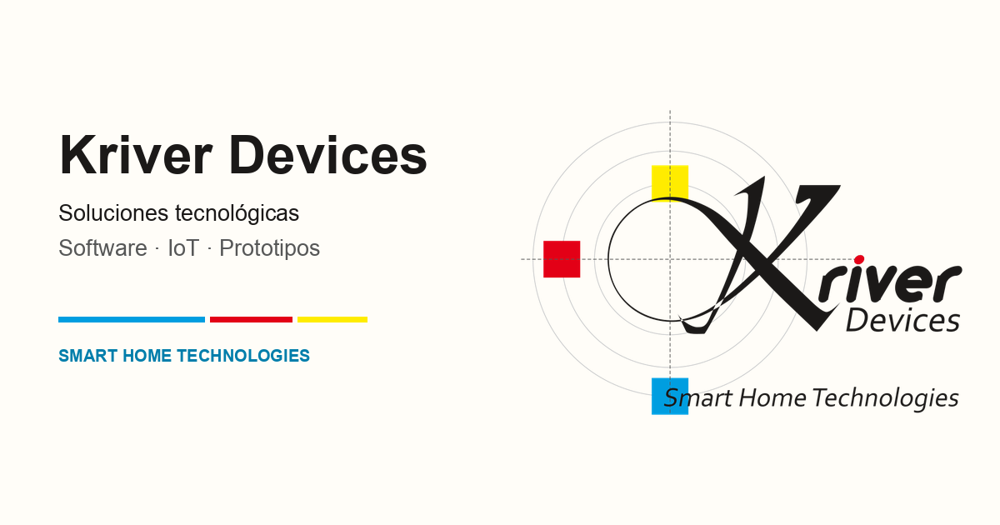

<a href="https://krisskira.github.io/personal-landing-page/">
  
</a>

# Kriver Devices

Estudio de aplicaciones móviles, sitios web y sistemas para el hogar conectado, desde la idea hasta producción. En Colombia, con trabajo remoto.

[Sitio](https://krisskira.github.io/personal-landing-page/) · [LinkedIn](https://www.linkedin.com/in/cristian-david-vergara-gomez/) · [Correo](mailto:krisskira@gmail.com) · [Read in English](README.md)

## Qué construyo

- **Apps móviles** para iOS, Android y multiplataforma, para que el producto llegue a la gente sin un muro de plataforma.
- **Sitios y aplicaciones web**, full stack, de la interfaz a los datos.
- **Hardware e IoT** con ESP32, STM32 y Linux embebido, cuando el problema empieza en el dispositivo.

El sitio también guarda tutoriales, fichas de proyectos y una página breve de cómo llegué hasta aquí.

## En el sitio

- **Inicio** — servicios, una muestra de tutoriales y el formulario de contacto.
- **Tutoriales** — videos y posts, filtrables por tipo.
- **Proyectos** — trabajos seleccionados, cada uno con su página.
- **Sobre mí** — el recorrido del firmware a los productos en los que trabajo ahora.
- **Pagos** — una página privada, fuera del índice de búsqueda.

## Arranque

React, TypeScript y Vite.

```bash
npm install
npm run dev
npm run build
```

Copia `.env` y define `VITE_SITE_URL` con la URL pública. El contenido vive en `src/content/`. Los textos en inglés están en `src/i18n/en.json`: la clave es el texto en español, exacto.

El sitio se publica con `.github/workflows/pages.yml` en cada push a `main` que toque la app. En el repositorio: **Settings → Pages → Source: GitHub Actions**. La URL actual es <https://krisskira.github.io/personal-landing-page/>.

Autor: **Crhistian David Vergara Gómez** · **krisskira@gmail.com**
